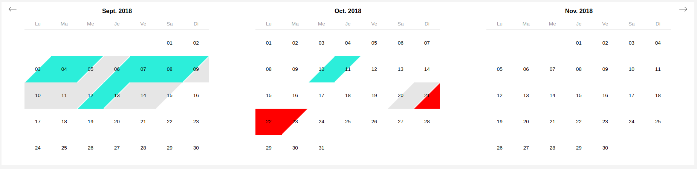

# vue-range-calendar

## Another Calendar for VueJS !

Displays many months. Display range dates with different colors. Enables date range selection. Two modes (half-day or full-day)

### Demo



### Compatibility

Tested on Chrome 68+, IE11/Edge, Safari 5

## How to use
```
yarn add vue-range-calendar
// or npm install vue-range-calendar
```

In your Vue setp:
```

const Moment = require('moment')
const MomentRange = require('moment-range')
const MomentExtended = MomentRange.extendMoment(Moment)

import VueMoment from 'vue-moment'
import 'moment/locale/fr.js'

Vue.use(VueMoment, { moment: MomentExtended })
```

In your vue template:
```
<calendar
  start-day="2018-09-01"
  :months-number="3"
  :types="types"
  :options="options"
  :is-selection-valid-function="isSelectionValid"
  :is-day-selectable-function="isDaySelectable"
  @selected-range="selectedRange($event)"
/>
```

In your vue script:
```
<script>
  export default {
    data() {
      return {
        options: {
          mode: 'half-day', // or 'full-day'
          locale: 'fr',
          colors: {
            invalid: '#999',
            hover: '#8acdf6',
            selected: '#8acdf6'
          }
        },
        types: {
          booked: {
            periods: [
              ['2018-09-03', '2018-09-04', '2018-09-05'],
              ['2018-09-06', '2018-09-07', '2018-09-08', '2018-09-09'],
            ],
            color: '#2ceeda'
          },
          blocked: {
            periods: [
              ['2018-09-05', '2018-09-06'],
              ['2018-09-09', '2018-09-10', '2018-09-11', '2018-09-12'],
            ],
            color: '#e6e6e6'
          }
        }
      }
    },
    methods: {
      isDaySelectable: function (day) {
        // Implement me
        return true
      },
      isSelectionValid: function (selectedDays, days) {
        // Implement me
        return true
      },
      selectedRange: function(range) {
        // Implement me
        alert('Range selected: from ' + range.start + ' to ' + range.end)
      }
    }
  }
</script>
```

## Project setup (in case you want to edit it)
```
git clone && cd
yarn install
```

### Compiles and hot-reloads for development
```
yarn run serve
```

### Compiles and minifies for production
```
yarn run build
```

### Lints and fixes files
```
yarn run lint
```
